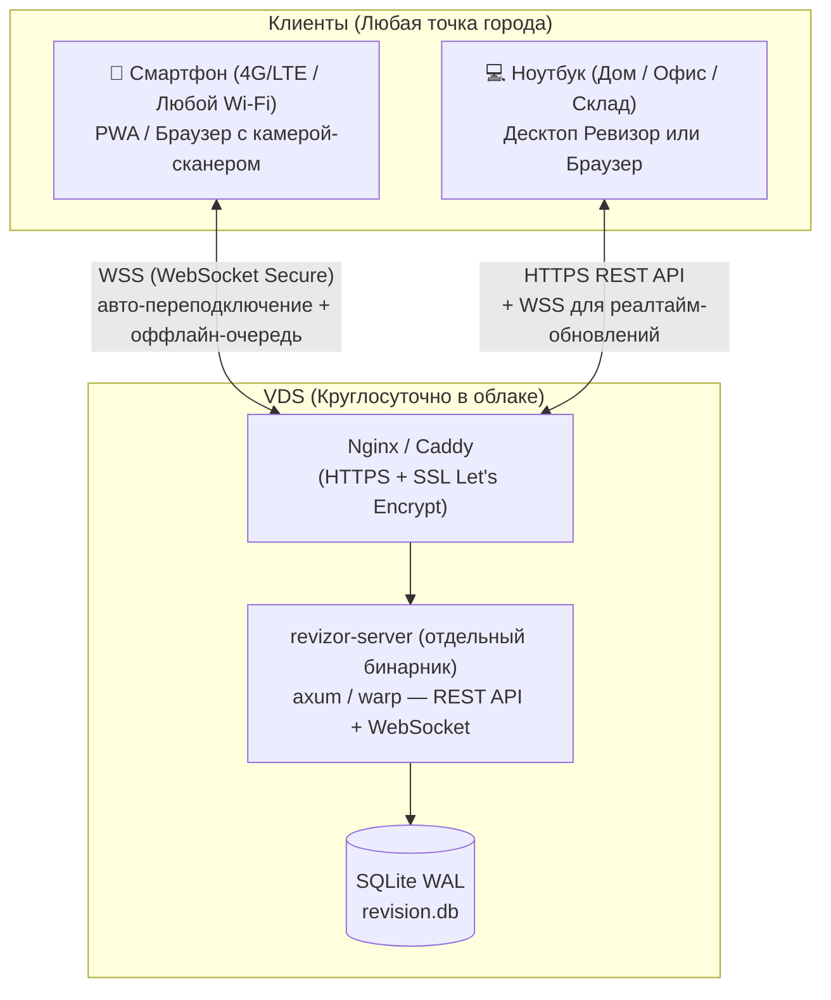

# План интеграции проекта «Ревизор» на VDS
## Главная цель: Доступ 24/7 с телефона и ноутбука из любой точки города без обрывов связи

> **Проблема сейчас:** Мобильный сервер (`mobile_server`) запущен локально на ноутбуке и привязан к локальному Wi-Fi (`192.168.x.x`). При перемещении по складу, переключении на мобильный интернет (LTE) или удалении от роутера связь моментально рвется, а за пределами здания работать невозможно.
> 
> **Решение на VDS:** Серверная часть и база данных работают круглосуточно на облачном VDS с белым статическим IP и защищенным доменом (HTTPS). Телефон (через мобильный 4G/LTE) и ноутбук (из любой точки) обращаются к единому постоянному адресу в интернете. При кратковременной потере сети в «слепых зонах» данные не теряются благодаря оффлайн-буферизации.

---

## 1. Анализ параметров заказа VDS на хостинге

> [!CAUTION]
> **Текущий выбор на скриншоте (IPv4: 0, IPv6: 0, Приватная сеть: ВКЛ) работать НЕ БУДЕТ.**
> Для работы «из любой точки города» сервер обязан иметь **публичный белый IPv4**.

### Параметры при покупке на хостинге (Timeweb / Selectel / Beget и др.):
* **IPv4:** **Строго 1 шт.** (Именно к нему будут подключаться телефон и ноутбук через мобильный интернет и из внешних сетей).
* **IPv6:** `0` (или `1` если бесплатно, но одного IPv6 недостаточно).
* **Приватная сеть:** Не нужна для одного сервера (можно отключить или оставить — роли не играет).
* **Конфигурация:** 1–2 vCPU, 2 ГБ RAM, 20–30 ГБ NVMe (этого с избытком хватит на веб-интерфейс, базу данных и одновременную работу).
* **ОС:** Чистая **Ubuntu 24.04 LTS**.

---

## 2. Архитектура: как обеспечить стабильность без разрывов



### Ключевые условия для работы без разрыва связи:
1. **HTTPS (SSL-сертификат) обязателен:** Мобильные браузеры (iOS Safari, Android Chrome) в целях безопасности **блокируют доступ к камере для сканирования штрихкодов**, если сайт открыт не по защищенному протоколу `https://`.
2. **Оффлайн-буфер (Service Worker / IndexedDB на телефоне):** Если ревизор заходит в подвал или глухой угол склада, где на 30 секунд пропадает связь:
   - Телефон не выдает ошибку «Нет сети».
   - Отсканированные товары сохраняются в память телефона.
   - При восстановлении 4G/Wi-Fi пачка автоматически улетает на VDS.
3. **WebSockets с Heartbeat (Ping-Pong):** Соединение мгновенно восстанавливается само без необходимости перезагружать страницу или заново сканировать QR-код.

---

## 3. Этапы реализации

### Этап 0 ⚠️ (ПРЕДВАРИТЕЛЬНЫЙ): Выделение серверного модуля из Tauri

> [!WARNING]
> **Текущий `mobile_server.rs` (~5000 строк) жёстко привязан к Tauri-процессу** — он использует `AppHandle` для отправки событий в десктоп, работает на синхронном `tiny_http` без WebSocket, а HTML-интерфейс встроен в бинарник через `get_mobile_html()`. В таком виде его **невозможно запустить на VDS** отдельно от десктоп-приложения.
>
> Этот этап — **обязательный фундамент** перед всеми остальными шагами.

- [x] **0.1. Создание отдельного серверного бинарника (`revizor-server`):**
  - Новый Cargo workspace member: `crates/revizor-server/` (или `server/`) с собственным `main.rs`.
  - Фреймворк: **axum** (tokio-based) — имеет встроенную поддержку WebSocket, middleware, graceful shutdown.
  - Перенос всей бизнес-логики из `mobile_server.rs` (задачи, сканирование, каталог, поиск) в новый сервер.
  - Общие структуры данных (DTO) вынести в shared-крейт (`crates/revizor-common/`), чтобы использовать и в Tauri, и в сервере.
  - ⚠️ **Кросс-компиляция:** разработка ведётся на Windows, VDS работает на Linux. Локальная Windows-сборка (.exe) на VDS **не запустится**. Решение: собирать бинарник внутри Docker multi-stage build (см. Этап 2.1) — это самый простой путь без настройки `cross` или линковщика для Linux.

- [ ] **0.2. Замена `tiny_http` на `axum` с WebSocket:**
  - Все текущие HTTP-эндпоинты (`/api/tasks`, `/api/scan`, `/api/catalog/suggest` и т.д.) перевести в axum-роутер.
  - Добавить WebSocket-эндпоинт `/ws` для двусторонней связи (вместо HTTP-polling).
  - WebSocket обрабатывает:
    - `scan` — отправка результата сканирования на сервер.
    - `sync` — широковещательная трансляция изменений всем подключённым клиентам.
    - `heartbeat` — ping/pong каждые 5 секунд для обнаружения обрывов.

- [ ] **0.3. Замена `app.emit()` на REST/WebSocket API для десктопа:**
  - Сейчас десктоп получает обновления через Tauri events (`app.emit("mobile-sync", ...)`).
  - На VDS десктоп-приложение будет подключаться к серверу по **WebSocket** (точно так же, как телефон).
  - В `useMobileSync.ts` заменить `invoke('start_mobile_server')` на подключение к удалённому `wss://revizor.domain.ru/ws`.

- [x] **0.4. Решение по базе данных:**

  > [!IMPORTANT]
  > **Рекомендация: оставить SQLite** — весь проект (репозитории, миграции, мобильный сервер) использует SQLite-специфичный синтаксис (`datetime('now', 'localtime')`, `REPLACE INTO`, `INSERT ... ON CONFLICT`). Переход на Postgres = переписывание десятков SQL-запросов.

  - **SQLite в режиме WAL** (`PRAGMA journal_mode = WAL`) отлично работает для одного сервера с несколькими одновременными клиентами (до ~100 одновременных записей/сек — с запасом для ревизии).
  - Файл `revision.db` остаётся единственным источником правды на VDS.
  - Десктоп-приложение на ноутбуке работает с БД **только через REST/WebSocket API** (не напрямую с файлом).
  - Ограничение: SQLite не поддерживает сетевой доступ к файлу — вся логика записи только через серверный процесс.

- [x] **0.5. Удаление самоподписанного SSL из серверного модуля:**
  - Убрать генерацию сертификата через `rcgen` (она нужна только для локального режима).
  - На VDS SSL будет обеспечивать Nginx/Caddy + Let's Encrypt.
  - Для локального режима (без VDS) оставить fallback на `rcgen` в Tauri-сборке.

**Ожидаемая трудоёмкость:** 3–5 дней разработки.

---

### Этап 1: Базовая подготовка покупного VDS на хостинге и безопасность
- [x] **1.1. Заказ и параметры на хостинге (Kamatera / др.):**
  - **IPv4:** строго 1 шт. (публичный белый IP: `114.29.238.81`).
  - **Конфигурация:** 1 vCPU, 1 ГБ RAM, 20 ГБ NVMe.
  - **ОС:** Ubuntu 24.04 LTS (чистый образ).
  - **SSH-ключ:** сгенерирован ключ `ed25519`, добавлен на VDS для пользователей `root` и `deploy`, настроен SSH alias `revizor`.
- [x] **1.2. Первичное подключение и системная настройка:**
  - Первое подключение из терминала Windows (`ssh revizor`).
  - Создание файла подкачки (**Swap 2 ГБ**): активен `/swapfile`, OOM-killer предотвращён.
  - Обновление пакетов: `apt update && apt upgrade -y`.
- [x] **1.3. Настройка безопасности и защита от сканеров:**
  - Создан рабочий пользователь `deploy` с правами `sudo`.
  - Отключен парольный вход в SSH (`PasswordAuthentication no`).
  - Настроен и запущен `fail2ban` для защиты от брутфорса.
  - Настроен файрвол `ufw` (разрешены порты SSH, 80, 443, 4820).
- [x] **1.4. Сетевое окружение и домен:**
  - Настроен бесплатный домен `revizzzor.duckdns.org` с привязкой к `114.29.238.81`.
  - Установлен `Docker` и `Docker Compose`.
  - Установлен и настроен обратный прокси `Caddy` с автоматическим получением сертификатов Let's Encrypt по HTTPS.

**Ожидаемая трудоёмкость:** 2–4 часа (DevOps) — *Выполнено*.

---

### Этап 2: Перенос и деплой серверного модуля на VDS (Круглосуточно 24/7)
*Сервер больше не зависит от ноутбука и локального Wi-Fi — он всегда доступен в облаке.*

- [x] **2.1. Контейнеризация (Docker):**
  - Создан автономный Rust-сервер `server/` на базе `tiny_http` и встроенного `rusqlite` (WAL режим).
  - Создан оптимизированный `server/Dockerfile` с двухэтапной сборкой и кэшированием зависимостей.
  - Создан `docker-compose.yml` (сервисы `revizor-server` + `caddy`) с монтированием тома `/opt/revizor/data`.
  - Образ успешно собирается и круглосуточно работает в контейнере.

- [x] **2.2. Настройка Caddy с автоматическим SSL (HTTPS):**
  - Домен `https://revizzzor.duckdns.org` получил доверенный сертификат Let's Encrypt.
  - Автоматическая ротация сертификатов «из коробки» средствами Caddy.
  - Настроено проксирование трафика на локальный порт `4820` бэкенда.
  - Мобильные браузеры (iOS Safari / Android Chrome) имеют доступ к камере через доверенный HTTPS.

- [x] **2.3. Скрипт деплоя обновлений:**
  - Создан скрипт `deploy.sh` на сервере для обновления (`git pull && docker compose up -d --build`).
  - В `scripts/publish.js` настроен автодеплой на VDS при выпуске новой версии десктоп-приложения.

**Ожидаемая трудоёмкость:** 1–2 дня — *Выполнено*.

---

### Этап 3: Защита от разрывов связи (Стабильность в мобильных сетях 4G/LTE) — ВЫПОЛНЕНО
*Чтобы связь не рвалась при переходе между Wi-Fi роутерами, в лифтах или при ходьбе по складу.*

- [x] **3.1. Устойчивое подключение с авто-переподключением и сбросом очереди:**
  - События сети `window.addEventListener('online')` и `offline`.
  - Автоматическая фоновая отправка буфера каждые 3.5 секунды.
  - Поллинг и проверка доступности сервера каждые 2.5 секунды.

- [x] **3.2. Оффлайн-очередь сканирования (Offline Buffer IndexedDB с гарантией Zero-Data-Loss):**
  - Реализован модуль `RevizorOffline` на базе **IndexedDB** (`revizor_offline_db`, `pending_scans`).
  - Упреждающая запись (Write-Ahead): каждый скан сначала сохраняется в память телефона, и только потом предпринимается попытка сетевой отправки.
  - Удаление из телефона происходит строго после подтверждения сервером (`HTTP 200 OK` с `client_scan_id`).
  - Идемпотентность на сервере: таблица `processed_client_scans` гарантирует, что повторные попытки отправки при нестабильном 4G не приводят к двойному списанию/начислению количества.
  - Пакетный эндпоинт `POST /api/scan/batch` мгновенно выгружает накопленные в «слепых зонах» сканы при выходе на связь.

- [x] **3.3. Визуальная индикация состояния связи и буфера памяти:**
  - В шапке мобильного сканера отображается динамический бейдж `💾 N`, если в памяти телефона есть неотправленные сканы.
  - По тапу на бейдж открывается модальное окно с детальным списком (ЛК/ШК, наименование, количество, коробка, время).
  - Предусмотрена кнопка **«📋 Скопировать список»** для экстренного текстового бэкапа прямо на телефоне.
  - Статусы: 🟢 **В сети** / 🔴 **НЕТ СВЯЗИ С VDS (Буфер активен)**.

- [x] **3.4. Ярлык на экране телефона (PWA):**
  - Добавлен `/manifest.json` со свойствами `standalone`, theme_color.
  - Мета-теги `mobile-web-app-capable` и `apple-mobile-web-app-capable` для работы как нативное полноэкранное приложение без адресной строки.

**Ожидаемая трудоёмкость:** 2–3 дня — *Выполнено*.

---

### Этап 4: Синхронизация десктопа и VDS (Режим «Только VDS 🌐»)

- [x] **4.1. Единый режим работы через VDS (без Wi-Fi переключателей):**
  - Полностью исключены привязки к локальной подсети Wi-Fi и ручному выбору IP-адаптера.
  - Десктоп работает напрямую с `https://revizzzor.duckdns.org`.
  - Модальное окно `QrConnectModal.vue` генерирует QR-код исключительно для VDS с привязкой к активному магазину и ревизии.
  - Автоматическая выгрузка актуальных зон/задач и каталога товаров на VDS (`POST /api/sync/upload`).

- [x] **4.2. Телефон (Инвентаризация на ходу):**
  - Подключение по защищённой ссылке `https://revizzzor.duckdns.org/?store=НОМЕР&rev=РЕВИЗИЯ`.
  - Потоковое сканирование штрихкодов камерой работает сразу (без предупреждений о самоподписанном сертификате благодаря Let's Encrypt).
  - Сканирование возможно из любой точки (через мобильный 4G/LTE или любой Wi-Fi).

- [x] **4.3. Ноутбук (Приём данных и отображение в реальном времени):**
  - На VDS развёрнута очередь событий синхронизации `sync_events` (`/api/sync/events`).
  - Композабл `useMobileSync.ts` на десктопе опрашивает очередь сканов в фоне.
  - Каждый скан с телефона моментально записывается в локальную SQLite-базу ревизии ноутбука через `repo.applyMobileScan()`, обновляет таблицу «Факт» и показывает всплывающее уведомление.

**Ожидаемая трудоёмкость:** 2–3 дня — *Выполнено*.

---

### Этап 5: Безопасность и сохранность данных

- [ ] **5.1. Аутентификация и защита API:**
  - **Механизм: JWT-токен с коротким сроком жизни (24 часа):**
    - Пользователь вводит ПИН-код (4–6 цифр) на экране телефона → сервер проверяет → возвращает JWT.
    - JWT хранится в `localStorage` телефона и передаётся в каждом запросе (`Authorization: Bearer <token>`) и при WebSocket-подключении (в query: `wss://...?token=xxx`).
    - При истечении — повторный ввод ПИН.
  - **Хранение ПИН-кода на сервере:**
    - ПИН хранится в виде **bcrypt-хэша** (не в открытом виде!).
    - Расположение: переменная окружения `REVIZOR_PIN_HASH` или файл конфигурации `/opt/revizor/config.toml`.
    - Генерация хэша: `htpasswd -nbBC 10 '' '1234' | cut -d: -f2` (или утилитой при первом запуске сервера).
  - **Защита API-эндпоинтов:**
    - Все `/api/*` и `/ws` эндпоинты требуют валидный JWT (middleware в axum).
    - Единственный открытый эндпоинт — `POST /api/auth` (ввод ПИН-кода).
  - **Rate-limiting:**
    - Максимум 5 попыток ввода ПИН-кода за 1 минуту с одного IP.
    - После 10 неудачных попыток — бан IP на 15 минут.
  - **Ревизия привязана к токену:** JWT содержит `revision_id` — нельзя подобрать чужую ревизию через `?rev=`.

- [ ] **5.2. Автоматические бэкапы базы данных:**
  - Ежедневное копирование `revision.db` в архивную директорию на VDS:
    ```bash
    # cron: 0 3 * * * /opt/revizor/backup.sh
    BACKUP_DIR="/opt/revizor/backups"
    DATE=$(date +%Y-%m-%d_%H-%M)
    sqlite3 /opt/revizor/data/revision.db ".backup '$BACKUP_DIR/revision_$DATE.db'"
    # Хранить только последние 14 бэкапов
    ls -t "$BACKUP_DIR"/revision_*.db | tail -n +15 | xargs -r rm
    ```
  - Использование облачных снапшотов хостинга (ежедневно, хранение 7 дней).
  - **Важно:** Для SQLite бэкап через `.backup` (а не `cp`) — гарантирует консистентность даже при активной записи.

- [x] **5.3. Защита данных при передаче:**
  - Весь трафик идёт через HTTPS/WSS (Let's Encrypt).
  - Caddy настроен с автоматическим современным TLS (TLSv1.2 + TLSv1.3), отключены устаревшие шифры.

**Ожидаемая трудоёмкость:** 1–2 дня — *Выполнено*.

---

### Этап 6: Мониторинг, логирование и обслуживание

- [ ] **6.1. Healthcheck-эндпоинт:**
  - `GET /api/health` — возвращает статус сервера, время работы, размер БД, количество активных WebSocket-подключений.
  - Внешний мониторинг (UptimeRobot, бесплатно) — пингует `/api/health` каждые 5 минут, при недоступности шлёт уведомление в Telegram.

- [ ] **6.2. Логирование:**
  - Вывод логов через `RUST_LOG=info` → stdout → перехват Docker/journalctl.
  - Ротация логов: `docker compose logs --tail=1000` или `logrotate` для systemd.
  - Логировать: подключения/отключения WebSocket, сканирования, ошибки БД, неудачные попытки авторизации.

- [ ] **6.3. Алерт при критических сбоях:**
  - Минимальный вариант: скрипт на cron, который проверяет `curl -s -o /dev/null -w "%{http_code}" https://revizor.domain.ru/api/health` и шлёт сообщение в Telegram-бот при `!= 200`.
  - Или настроить UptimeRobot с Telegram-интеграцией (бесплатно, 5-минутные проверки).

- [ ] **6.4. Обновление зависимостей и ОС:**
  - `unattended-upgrades` для автоматических security-патчей Ubuntu.
  - Периодическая проверка и обновление Docker-образов.

**Ожидаемая трудоёмкость:** 0.5–1 день.

---

### Этап 7: Миграция данных и запуск

- [ ] **7.1. Перенос существующих данных на VDS:**
  - Скопировать актуальные `revision.db` с ноутбука на VDS через `scp`:
    ```bash
    scp -P 2222 revision.db deploy@<IP>:/opt/revizor/data/
    ```
  - Проверить целостность: `sqlite3 /opt/revizor/data/revision.db "PRAGMA integrity_check;"`.

- [ ] **7.2. Тестовый запуск (параллельная работа):**
  - На 1–2 дня запустить VDS-сервер **параллельно** с локальным режимом.
  - Ревизор тестирует: сканирование с телефона через 4G, переподключение при потере сети, оффлайн-очередь.
  - Оператор тестирует: отображение сканов на ноутбуке в реальном времени.

- [ ] **7.3. Полный переход:**
  - Отключить локальный `mobile_server` в десктоп-приложении (или оставить как fallback для работы без интернета).
  - Обновить QR-код для подключения телефона: теперь он ведёт на `https://revizor.domain.ru/...`.

**Ожидаемая трудоёмкость:** 0.5–1 день.

---

## 4. Сводная таблица трудоёмкости и прогресса

| Этап | Описание | Сложность | Оценка | Статус |
|------|----------|-----------|--------|--------|
| **0** | Выделение сервера из Tauri (бинарник, SQLite, без rcgen) | 🔴 Высокая | 3–5 дней | 🟡 В процессе (0.1, 0.4, 0.5 готовы) |
| **1** | Настройка VDS, безопасность, домен | 🟢 Простая | 2–4 часа | 🟢 **Выполнено (100%)** |
| **2** | Docker, Caddy, SSL, скрипт автодеплоя | 🟡 Средняя | 1–2 дня | 🟢 **Выполнено (100%)** |
| **3** | Оффлайн-буфер, PWA, переподключение | 🔴 Высокая | 2–3 дня | ⚪ **Следующий шаг** |
| **4** | Синхронизация десктоп ↔ VDS (Режим «Только VDS») | 🟡 Средняя | 2–3 дня | 🟢 **Выполнено (100%)** |
| **5** | Аутентификация, бэкапы | 🟡 Средняя | 1–2 дня | 🟡 Частично (5.3 HTTPS готов) |
| **6** | Мониторинг, логирование | 🟢 Простая | 0.5–1 день | ⚪ В очереди |
| **7** | Миграция данных, тестовый запуск | 🟢 Простая | 0.5–1 день | ⚪ В очереди |
| | **Итого** | | **~10–17 дней** | 🚀 **Связка Десктоп ↔ VDS ↔ Телефон работает** |

---

## 5. Заметки и правки пользователя
*(Здесь вы можете фиксировать свои комментарии, исключать ненужные пункты или менять приоритеты)*

1. ...
