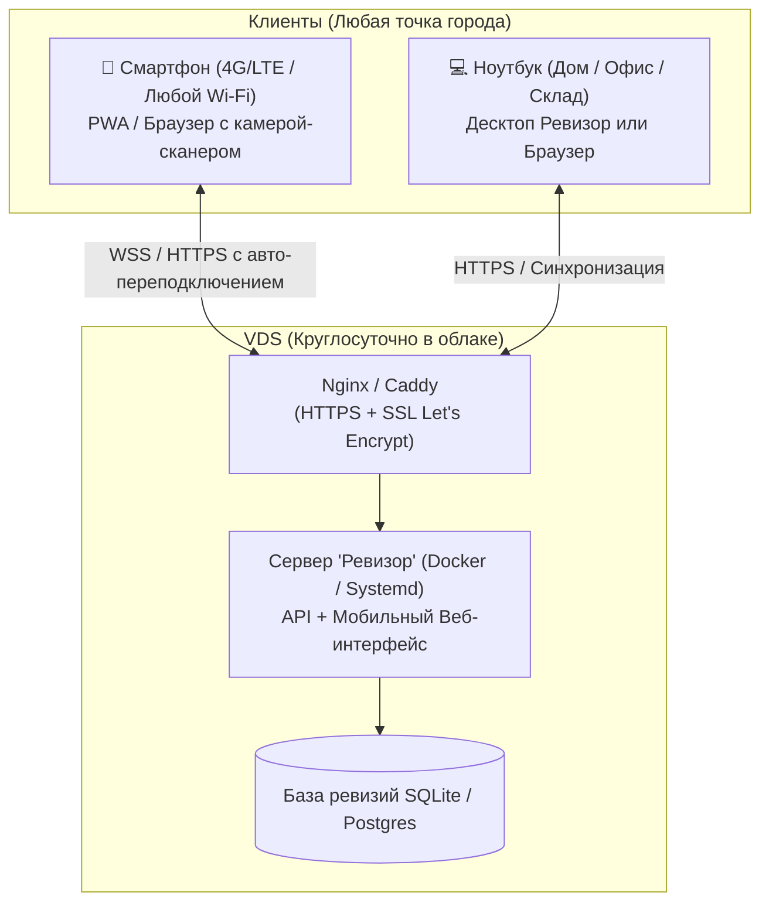

# План интеграции проекта «Ревизор» на VDS
## Главная цель: Доступ 24/7 с телефона и ноутбука из любой точки города без обрывов связи

> **Проблема сейчас:** Мобильный сервер (`mobile_server`) запущен локально на ноутбуке и привязан к локальному Wi-Fi (`192.168.x.x`). При перемещении по складу, переключении на мобильный интернет (LTE) или удалении от роутера связь моментально рвется, а за пределами здания работать невозможно.
> 
> **Решение на VDS:** Серверная часть и база данных работают круглосуточно на облачном VDS с белым статическим IP и защищенным доменом (HTTPS). Телефон (через мобильный 4G/LTE) и ноутбук (из любой точки) обращаются к единому постоянному адресу в интернете. При кратковременной потере сети в «слепых зонах» данные не теряются благодаря оффлайн-буферизации.

---

## 1. Анализ параметров заказа VDS на хостинге

> [!CAUTION]
> **Текущий выбор на скриншоте (IPv4: 0, IPv6: 0, Приватная сеть: ВКЛ) работать НЕ БУДЕТ.**
> Для работы «из любой точки города» сервер обязан иметь **публичный белый IPv4**.

### Параметры при покупке на хостинге (Timeweb / Selectel / Beget и др.):
* **IPv4:** **Строго 1 шт.** (Именно к нему будут подключаться телефон и ноутбук через мобильный интернет и из внешних сетей).
* **IPv6:** `0` (или `1` если бесплатно, но одного IPv6 недостаточно).
* **Приватная сеть:** Не нужна для одного сервера (можно отключить или оставить — роли не играет).
* **Конфигурация:** 1–2 vCPU, 2 ГБ RAM, 20–30 ГБ NVMe (этого с избытком хватит на веб-интерфейс, базу данных и одновременную работу).
* **ОС:** Чистая **Ubuntu 24.04 LTS**.

---

## 2. Архитектура: как обеспечить стабильность без разрывов

### Ключевые условия для работы без разрыва связи:
1. **HTTPS (SSL-сертификат) обязателен:** Мобильные браузеры (iOS Safari, Android Chrome) в целях безопасности **блокируют доступ к камере для сканирования штрихкодов**, если сайт открыт не по защищенному протоколу `https://`.
2. **Оффлайн-буфер (Service Worker / LocalStorage на телефоне):** Если ревизор заходит в подвал или глухой угол склада, где на 30 секунд пропадает связь:
   - Телефон не выдает ошибку «Нет сети».
   - Отсканированные товары сохраняются в память телефона.
   - При восстановлении 4G/Wi-Fi пачка автоматически улетает на VDS.
3. **WebSockets с Heartbeat (Ping-Pong):** Соединение мгновенно восстанавливается само без необходимости перезагружать страницу или заново сканировать QR-код.

---

## 3. Этапы реализации

### Этап 1: Базовая подготовка покупного VDS на хостинге и безопасность
- [ ] **1.1. Заказ и параметры на хостинге (Timeweb / Selectel / Beget / др.):**
  - **IPv4:** строго 1 шт. (публичный белый IP).
  - **Конфигурация:** 1-2 vCPU, 2-4 ГБ RAM, 20-40 ГБ NVMe (для старта под обновления и БД этого с запасом).
  - **ОС при заказе:** Ubuntu 24.04 LTS (чистый образ без предустановленных панелей вроде ISPmanager, чтобы не тратить оперативку).
  - **SSH-ключ:** при оформлении вставить свой публичный ключ (сгенерированный на Windows: `ssh-keygen`), чтобы сразу отключить парольный вход `root`.
  - **Автобэкапы хостинга:** включить опцию автоматических снапшотов/бэкапов в панели хостинга (гарантия быстрого отката при сбоях).
- [ ] **1.2. Первичное подключение и системная настройка:**
  - Первое подключение из терминала Windows (PowerShell: `ssh root@<IP_ХОСТИНГА>`).
  - Создание файла подкачки (**Swap 2-4 ГБ**): на облачных VDS swap по умолчанию часто отключен, из-за чего при пиках памяти Linux OOM-killer аварийно глушит Docker или базу данных.
  - Обновление пакетов: `apt update && apt upgrade -y`.
- [ ] **1.3. Настройка безопасности и защита от сканеров:**
  - На покупных VDS сканирование ботами начинается через 5 минут после выдачи IP.
  - Создание рабочего пользователя `deploy` с правами `sudo`.
  - Отключение парольного входа в SSH (`PasswordAuthentication no`) и прямого логина `root` (`PermitRootLogin prohibit-password`).
  - Смена стандартного порта SSH с `22` на нестандартный (например, `2222` или `49152+`) — снижает 99% мусорных попыток подбора.
  - Настройка `fail2ban` для блокировки сканеров.
  - Настройка файрвола: если в панели хостинга есть **«Сетевой экран / Файрвол»**, настроить правила там (открыть порты SSH, 80, 443), либо через `ufw` внутри сервера.
- [ ] **1.4. Сетевое окружение и домен:**
  - Привязка домена (через A-запись на DNS хостинга или Cloudflare).
  - *Лайфхак хостинга:* Если домена пока нет, многие хостинги бесплатно дают технический домен третьего уровня (например, `xxx.twc1.net`), на который сразу можно выпустить SSL.
  - Установка `Docker` и `Docker Compose` (официальный репозиторий Docker).
  - Установка обратного прокси `Nginx` (или `Caddy` со встроенным авто-SSL).

---

### Этап 2: Перенос мобильного сервера на VDS (Круглосуточно 24/7)
*Сервер больше не зависит от ноутбука и локального Wi-Fi — он всегда доступен в облаке.*

- [ ] **2.1. Автономный запуск сервера на VDS:**
  - Запуск серверного модуля (обслуживающего мобильный веб-интерфейс сканирования и базу данных `revision.db`) в виде отдельного сервиса под Linux (через Docker или systemd daemon).
  - Настройка автоматического перезапуска при любых сбоях (`Restart=always`).
- [ ] **2.2. Настройка Nginx с SSL (HTTPS) и WebSocket:**
  - Привязка домена или поддомена с автоматическим сертификатом Let's Encrypt (`certbot`).
  - **Критично:** Настройка проксирования WebSocket (`Upgrade`, `Connection: "Upgrade"`), чтобы телефон и ноутбук мгновенно получали обновления сканирования без задержек.
  - Без HTTPS мобильные браузеры (iOS Safari / Android Chrome) блокируют доступ к камере для сканирования штрихкодов.

---

### Этап 3: Защита от разрывов связи (Стабильность в мобильных сетях 4G/LTE)
*Чтобы связь не рвалась при переходе между Wi-Fi роутерами, в лифтах или при ходьбе по складу.*

- [ ] **3.1. Мгновенное авто-переподключение (Auto-Reconnect):**
  - Механизм фонового Heartbeat (пинг каждые 3–5 секунд).
  - При переключении сети (Wi-Fi ➔ 4G ➔ Wi-Fi) соединение восстанавливается автоматически за 300 мс без перезагрузки страницы и без потери активной ревизии.
- [ ] **3.2. Оффлайн-очередь сканирования (Offline Buffer):**
  - Если связь кратковременно пропала («слепая зона» на складе):
    - Сканер продолжает считывать штрихкоды и пищать подтверждением.
    - Отсканированные товары сохраняются в память телефона (`LocalStorage` / `IndexedDB`).
    - Как только связь с VDS восстанавливается, все накопленные сканы автоматически синхронизируются с сервером.
- [ ] **3.3. Ярлык на экране телефона (PWA):**
  - Возможность добавить ярлык на рабочий стол смартфона в 1 клик (работа в полноэкранном режиме как настоящее мобильное приложение).

---

### Этап 4: Единовременная работа с телефона и ноутбука из любой точки города
- [ ] **4.1. Телефон (Инвентаризация на ходу):**
  - Подключение по ссылке вида `https://revizor.domain.ru/?rev=...` (или через QR-код).
  - Сканирование штрихкодов камерой из любой точки (хоть из другого филиала города).
- [ ] **4.2. Ноутбук (Сводные данные и контроль):**
  - Открытие того же рабочего стола ревизии в браузере или в приложении на ноутбуке из офиса или из дома.
  - Онлайн-отображение: оператор на ноутбуке видит каждую отсканированную ревизором позицию в режиме реального времени.

---

### Этап 5: Безопасность и сохранность данных
- [ ] **5.1. Защита доступа:**
  - Быстрый ПИН-код или токен сессии, чтобы в вашу базу не зашли посторонние из интернета.
- [ ] **5.2. Автоматические бэкапы базы данных:**
  - Ежедневное копирование базы ревизий в архивную директорию на VDS + использование облачных снапшотов хостинга.

---

## 4. Заметки и правки пользователя
*(Здесь вы можете фиксировать свои комментарии, исключать ненужные пункты или менять приоритеты)*

1. ...
